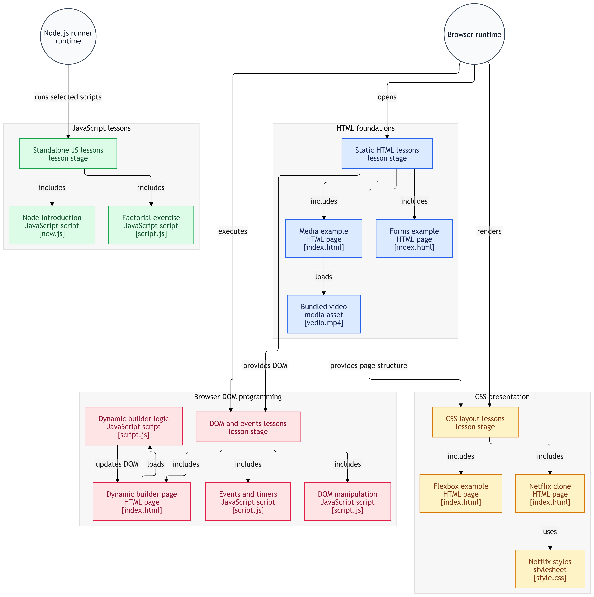
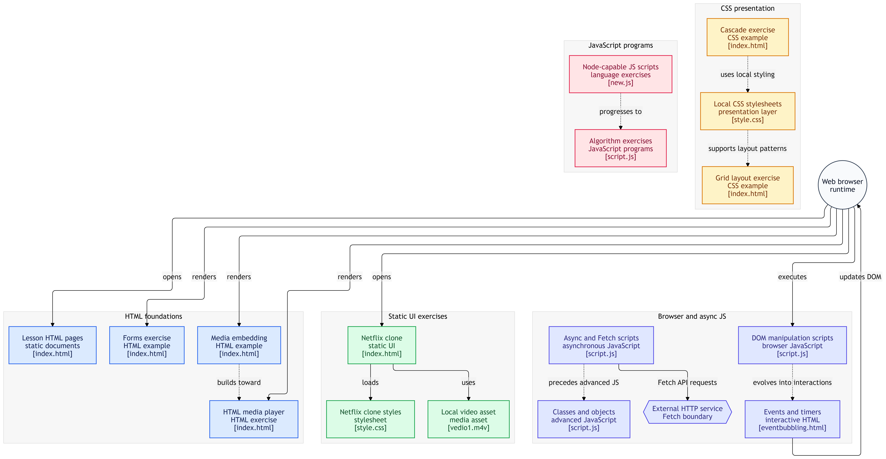

<div align="center">
  <!-- Dynamic Gradient Header -->
  
  
  <!-- Animated Typing Effect -->
  <a href="https://git.io/typing-svg">
    
  </a>

  <br />

  <!-- Dynamic GitHub Status Badges -->
  
  
  
</div>

## 🌐 Project Overview
This repository serves as a comprehensive, day-by-day architectural log of the **Sigma Web Development Course**. It tracks the progression from foundational web semantics and responsive CSS layouts into high-level, asynchronous JavaScript engineering. 

## 🧠 Core Engineering Concepts

| Category | Topics Covered |
| :--- | :--- |
| **DOM Architecture** | Traversal, element injection/removal, dynamic styling, geometry manipulation. |
| **Async Execution** | Event loops, Callbacks, Promises, `async/await`, Fetch API integration. |
| **State & Logic** | Error handling (`try/catch`), Object-Oriented Programming (Classes/Objects), timers. |
| **UI/UX Engineering** | Flexbox, CSS Grid, absolute positioning, responsive media queries. |

## 🛠️ Technology Stack

<div align="center">
  
  
  
  
  
  
  
  
  
</div>

<br />

## 🚀 Featured Deployments & Exercises

<table>
  <tr>
    <td width="50%" valign="top">
      <h3>📺 Netflix UI Clone</h3>
      <p><b>Day 53</b> | <i>HTML5, Custom CSS</i></p>
      <p>A pixel-perfect, responsive frontend architecture mimicking the Netflix web client using semantic tags and pure CSS grid/flexbox mechanisms.</p>
    </td>
    <td width="50%" valign="top">
      <h3>💻 Hacker's Terminal</h3>
      <p><b>Day 78</b> | <i>JS Async/Await, DOM</i></p>
      <p>A simulated command-line sequence utilizing JavaScript <code>Promises</code>, <code>setTimeout</code>, and DOM injection to mimic real-time hacking terminal outputs.</p>
    </td>
  </tr>
  <tr>
    <td width="50%" valign="top">
      <h3>🏗️ Dynamic Website Builder</h3>
      <p><b>Day 73</b> | <i>JS Component Generation</i></p>
      <p>Automated DOM manipulation scripts that intake raw data payloads and dynamically construct styled HTML elements on the virtual page.</p>
    </td>
    <td width="50%" valign="top">
      <h3>🎨 Geometric Grid Modulator</h3>
      <p><b>Day 70</b> | <i>JS DOM Traversal</i></p>
      <p>Algorithmic styling exercise capturing HTML collections and mapping dynamic, randomized color hexes directly to inline element properties.</p>
    </td>
  </tr>
</table>

## 📂 Repository Architecture (Interactive Index)

<details>
<summary><b>▶️ Expand Detailed Day-by-Day JavaScript Progression</b></summary>
<br />

- **Day 70:** JavaScript DOM Manipulation - Color the Boxes
- **Day 71:** Inserting and Removing Elements using JS
- **Day 73:** JavaScript Exercise - Dynamic Website Builder
- **Day 74:** Events, Event Bubbling, `setInterval` & `setTimeout`
- **Day 75:** JavaScript Callbacks & Promises
- **Day 76:** Async/Await & Fetch API in JavaScript
- **Day 77:** Logic Solutions & Code Refactoring
- **Day 78:** JavaScript Exercise - Hacker's Terminal
- **Day 79:** Error Handling - `try...catch` Blocks
- **Day 80:** Object-Oriented Programming (OOP) & Classes
- **Day 81:** Advanced Problem Solving Algorithms
- **Day 82:** Advanced JavaScript Execution Contexts
</details>

## ⚙️ Local Development Environment

```bash
# 1. Clone the repository to your local machine
git clone [https://github.com/Uditya-Pal-1/Sigma-Web-Development-Course.git](https://github.com/Uditya-Pal-1/Sigma-Web-Development-Course.git)

# 2. Navigate into the directory
cd Sigma-Web-Development-Course

# 3. Launch via IDE (requires VS Code)
code .
## Diagram


<hr>
